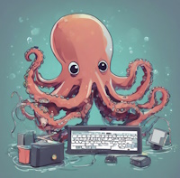
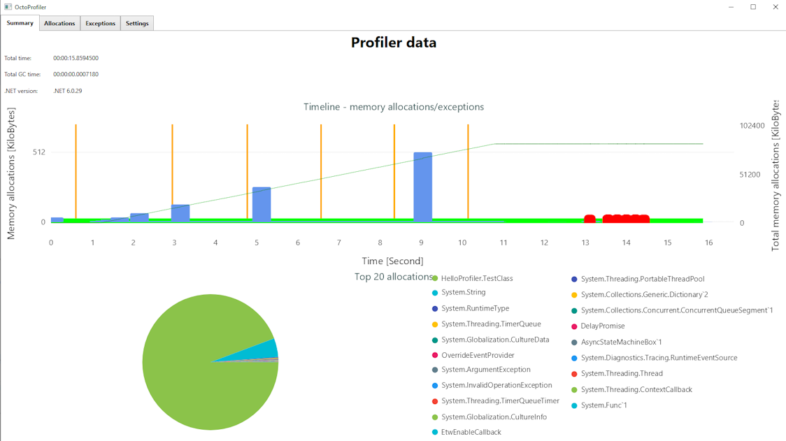
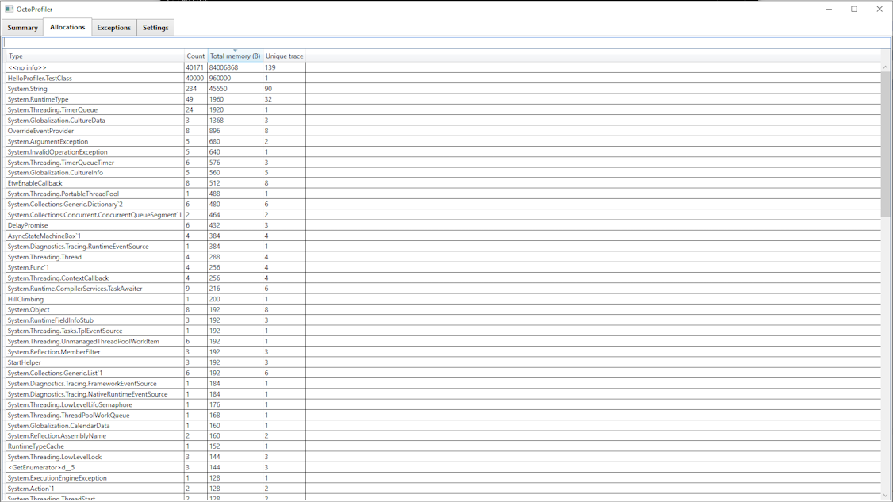
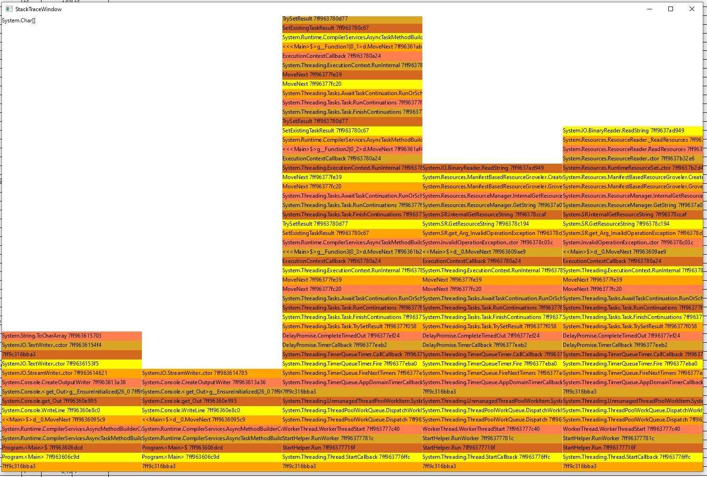
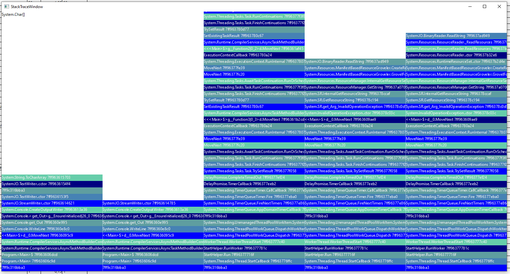
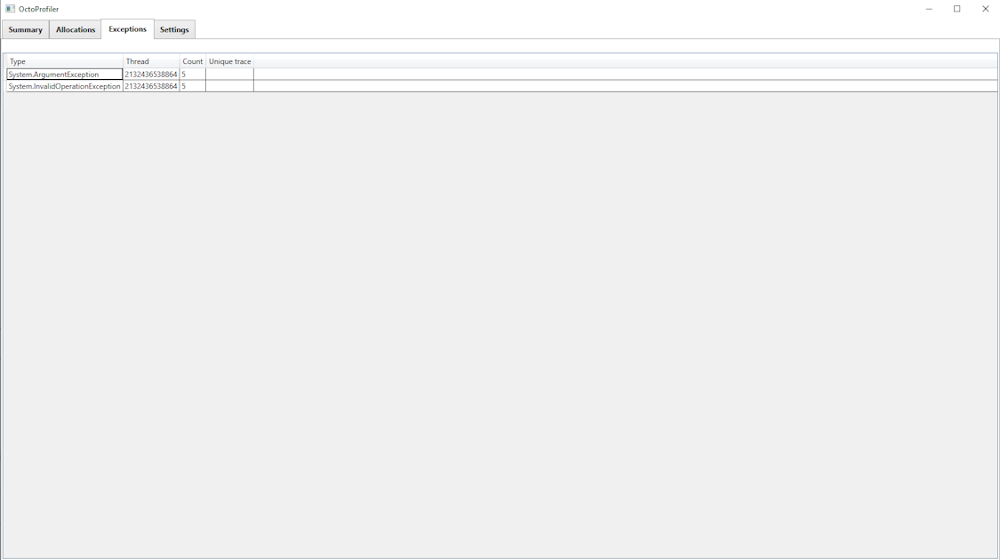
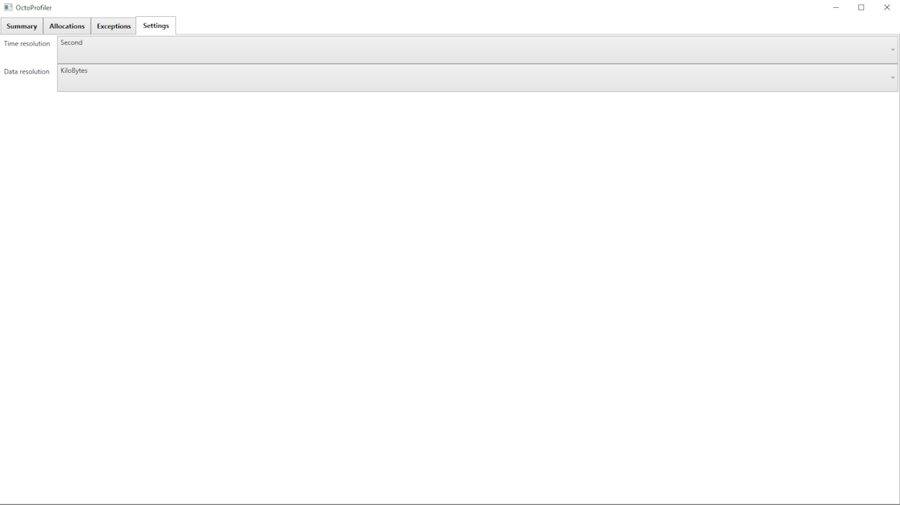

# symmetrical-octo-broccoli
Experimental .NET Profiler &amp; Debugger

# What is this #
An attempt to create (or at least gather some knowledge how to) build profiler and/or debugger for .NET.
This project was create as an entry into #100commitow competition.

Note: The name of the repo is auto-generated by Github repo name generator. ~~Finding a better name in-progress.~~

# How to use it #
There's a `run.bat` script that currently sets the profiler and executes the sample program. This script can be used to gather info
what needs to be set in order to run the program with the profiler attached.

For building instructions see [BUILDING.md](BUILDING.md).

# Docs #
Some reference links about the topic:
- https://github.com/dotnet/samples/tree/main/core/profiling
- https://learn.microsoft.com/en-us/dotnet/framework/unmanaged-api/profiling/
- https://learn.microsoft.com/en-us/dotnet/framework/unmanaged-api/debugging/

## Flame graph ##
- https://brendangregg.com/flamegraphs.html

# Plan #

## Profiler ##

Minimum plan:
- [x] implement profiler class that can be used as a profiler for .NET based applications
- [x] gather informations about stack traces during the excution of the program
- [ ] implement basic flame-graph to visualize the execution timelime

## Current state ##

Ability to start the program with the profiler attached directly from the console or from the OctoVis. There's also an option to attach to a running binary - for now only from the console and only to the .NET Framework ones.

OctoProfiler reacts to events and currently stors them in a text file that later are being parsed by the visualization.

Currently collected information:
- [x] allocations
- [x] exceptions
- [x] GC information
- [x] JIT
- [ ] function enter, exit

Running the profiler:

OctoVis can either start the program under the profiler or read the generated file and provide a visualization

Summary tab - general overview of the profiling session

Allocations tab - # of objects, memory used and count information

Flame graph showing the allocation paths:

Exceptions tab - "detail" information about thrown exceptions

Settings tab - settings to control the visualization

## Debugging ##

Issues found during development:

> Loading profiler failed.  There was an unhandled exception while trying to instantiate the profiler COM object.  Please ensure the CLSID is associated with a valid profiler designed to work with this version of the runtime.  Profiler CLSID: '{DC27BF80-3A36-40D4-9278-6415508C4ED6}'.

> Loading profiler failed.   The profiler that was configured to load was designed for an older version of the CLR.  You can use the COMPlus_ProfAPI_ProfilerCompatibilitySetting environment variable to allow older profilers to be loaded by the current version of the CLR.  Please consult the documentation for information on how to use this environment variable, and the risks associated with it.  Profiler CLSID: '{8A8CC829-CCF2-49FE-BBAE-0F022228071A}'.

> Loading profiler failed.  COR_PROFILER is set to a CLSID of a COM object that does not implement the interface GUID (IID) requested by the CLR.  This often indicates that the profiler does not support this version of the CLR.  Profiler CLSID: '{8a8cc829-ccf2-49fe-bbae-0f022228071a}'.  Requested IID: '{8A8CC829-CCF2-49FE-BBAE-0F022228071A}'.

It can be debugged with a native debugger. Setting a breakpoint at DllGetClassObject (`bp OctoProfiler!DllGetClassObject`) or `OctoProfiler::Initialize` (`bp OctoProfiler!OctoProfiler::Initialize`).

## Debugger ##

On hold for the moment. Working on the profiler part.

Minimum plan:
- [ ] starting a binary
- [ ] attaching
- [ ] setting a breakpoint